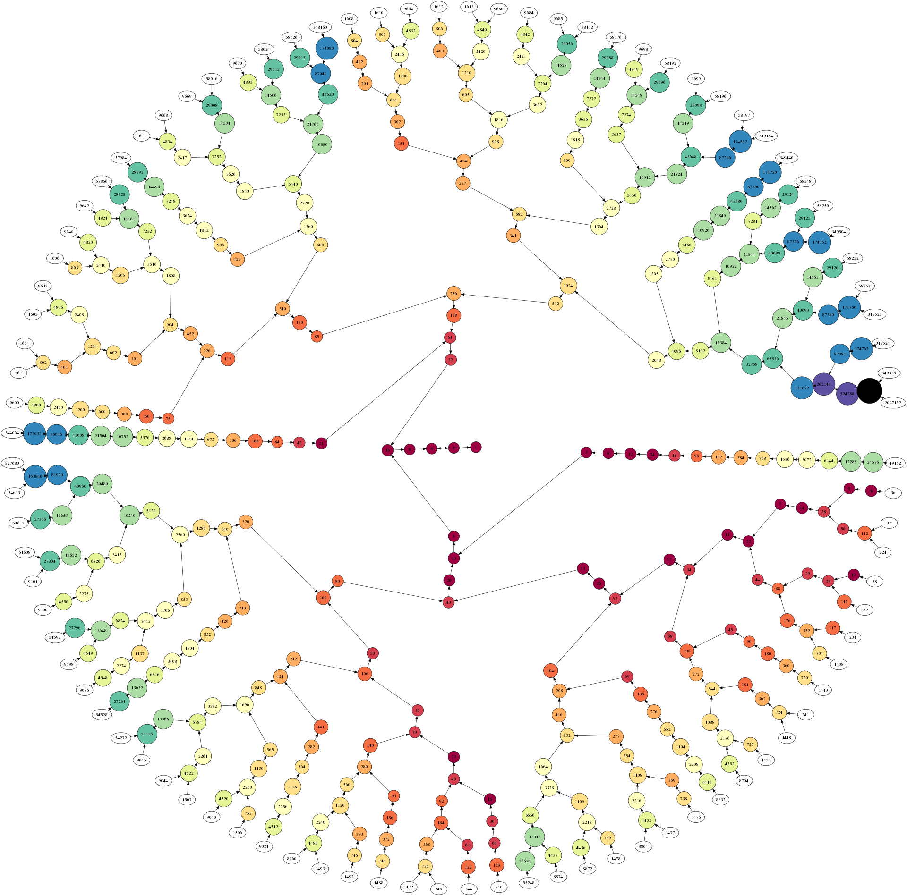

# Assignment 1 (R group)

> Analysis of the Collatz Conjecture

Please also read [`INSTRUCTIONS.md`](INSTRUCTIONS.md) for specific
submission instructions and marking rubric.

Your group will perform a data analysis of the Collatz Conjecture, a
well-known problem in mathematics. You’ll be expected to use
`{tidyverse}` data wrangling techniques and to generate visualisations
using `{ggplot2}`.
<!-- Your group will be assessed on code quality, collaboration, ability to manipulate data, and the ability to create meaningful visualizations. -->



## Background

The Collatz Conjecture is a mathematical conjecture concerning a
sequence defined as follows. Start with any positive integer $n$. Then
each term is obtained from the previous term according to these rules:

1.  If the previous term is even, the next term is one half of the
    previous term.
2.  If the previous term is odd, the next term is 3 times the previous
    term plus 1.

The conjecture is that no matter what value of $n$, the sequence will
always reach 1.

## Tasks

### 1) Generating the Collatz Conjecture

Create a function in R (call it `gen_collatz`) that takes a positive
integer `n` as input and generates the Collatz sequence until it
reaches 1. Implement a safeguard within your function to handle
instances where the input `n` is invalid.

Apply this function to all integers from 1 to 10,000 and store the
results in a tibble (named `collatz_df`). The tibble (at minimum) should
contain two columns: `start` (the starting integer value) and `seq` (the
Collatz sequence saved as a list). It should look something like this:

``` r
collatz_df
#> # A tibble: 10,000 × 5
#>    start seq        length parity max_val
#>    <int> <list>      <dbl> <chr>    <dbl>
#>  1     1 <dbl [1]>       1 Odd          1
#>  2     2 <dbl [2]>       2 Even         2
#>  3     3 <dbl [8]>       8 Odd         16
#>  4     4 <dbl [3]>       3 Even         4
#>  5     5 <dbl [6]>       6 Odd         16
#>  6     6 <dbl [9]>       9 Even        16
#>  7     7 <dbl [17]>     17 Odd         52
#>  8     8 <dbl [4]>       4 Even         8
#>  9     9 <dbl [20]>     20 Odd         52
#> 10    10 <dbl [7]>       7 Even        16
#> # ℹ 9,990 more rows
```

### 2) Exploratory data analysis

Use `{tidyverse}` data wrangling techniques to find the answers to the
following questions. For each question, save the R object with the
suggested name.

1.  Find the top 10 starting integers that produce the longest sequences
    \[`top10longest`\].

2.  Find out which starting integer produces a sequence that reaches the
    highest maximum value \[`max_val_int`\].

3.  What is the average length and standard deviation of the sequence
    for even starting integers compared to odd ones?
    \[`even_odd_avg_len` and `even_odd_sd_len`\]
    <!-- Is there a significant^[Apply an appropriate hypothesis test and report the $p$-value.] difference? -->

### 3) Investigating “backtracking” in sequences.

In this task, explore the concept of “backtracking” within the Collatz
sequences. Backtracking occurs when a sequence reaches a value that is
less than the starting integer, but then increases again above the
starting integer at least once before reaching 1.

1.  Filter `collatz_df` to retain starting integers that exhibit
    backtracking in their sequences. \[`backtracks_df`\]

2.  For sequences that backtrack, what is the most frequently occurring
    number of times they go above their starting integer?
    \[`mode_backtrack`\]

3.  What is the maximum value reached after the first backtrack for
    these sequences? \[`max_after_backtrack`\]

4.  Are backtracking sequences more common among even or odd starting
    integers? Give the frequency counts for even and odd backtracking
    integers. \[`even_odd_backtrack`\]

### 4) Visualisations

Using `{ggplot2}`, you will create appropriate graphs that visualise the
data wrangling tasks in Task 3 above.

1.  Create a scatterplot of all the sequence lengths, with the starting
    integer on the horizontal axis and the length of the sequence on the
    vertical axis. Identify the top 10 starting integers on your plot.

2.  Create another scatterplot, but this time graph the highest value
    reached in the sequence on the vertical axis. Highlight the top 10
    starting integers in a different color.

3.  Create a boxplot comparing the distributions of sequence lengths for
    even and odd starting integers. Are there any noticeable
    differences?

## 5) Open-ended exploration

In this part, your team will identify **one** interesting question or
pattern about the Collatz Conjecture sequences that you want to explore.
It could be something like:

- What is the most frequent integer that appears in all the sequences
  combined, excluding the number 1?
- Is there any correlation between the starting integers and the number
  of odd or even numbers in their sequence?
- What are the most common “stopping times,” i.e., the number of steps
  it takes for a sequence to first go below its starting integer?

The goal of this part is to provide unique insights into the sequences.
Present your findings in a way that is easy to understand for someone
who is not familiar with the topic. Document your process and
methodologies clearly.

## 6) Creative visualisation challenge

For this part of the assignment, your team is encouraged to come up with
a unique way to visualize some aspect of the Collatz Conjecture
sequences that you find interesting. The sky is the limit! You can
visualize:

- How sequence lengths change over a range of starting integers
- How quickly sequences reach 1, considering only the steps after they
  first reach a value less than their starting integer
- How often specific numbers (other than 1) appear in sequences, across
  all starting integers

You’re free to use additional R packages or visualization techniques
that have not been covered in the class.

## Checklist

You will create a total of 6 R files with the following names that
contain the code for each of the tasks listed above. Note that the
autograder will check only Tasks 1–3.

| Task | Filename            | Contains                                                                    |
|-----:|:--------------------|:----------------------------------------------------------------------------|
|    1 | `01-gen_collatz.R`  | `gen_collatz()` function and `collatz_df`                                   |
|    2 | `02-eda.R`          | `top10longest`, `max_Val_int`, `even_odd_avg_len`, `even_odd_sd_len`        |
|    3 | `03-backtracking.R` | `backtracks_df`, `mode_backtrack`, `max_after_backtrack`, `even_odd_sd_len` |
|    4 | `04-plots.R`        | `{ggplot2}` code for plots (not autograded)                                 |
|    5 | `05-open.R`         | Code for Task 5 Open-ended exploration                                      |
|    6 | `06-creative.R`     | Code for Task 6 Creative visualisation                                      |

## Summary

Present your solutions to all the tasks in this assignment on your
group’s GitHub repository, documenting them in the README file. While a
line-by-line code explanation is not necessary, the README should be
comprehensive enough that anyone who visits your repository can easily
grasp the objectives and outcomes of your Collatz conjecture analysis.

#### Contribution declaration

Please state in your README how each group member contributed to the
tasks. As an example:

- Task 1: @author1
- Task 2: @author2
- Task 3: @author3
- Task 4: @author2
- Task 5: @author4
- Task 6: @author1
- README: @author3
- other tasks…

#### RMarkdown (optional)

You are encouraged to explore the use of the RMarkdown format. First,
install the `{rmarkdown}` package. Then in RStudio, select File -\> New
File -\> Rmarkdown… and from the popup menu, select ‘From Template’ and
select ‘GitHub Document (Markdown)’ and press ‘OK’. A template document
should appear which you can ‘knit’ by clicking the button near the top
of the file name. Save this file as `README.Rmd`. Go ahead and edit this
file as necessary.
